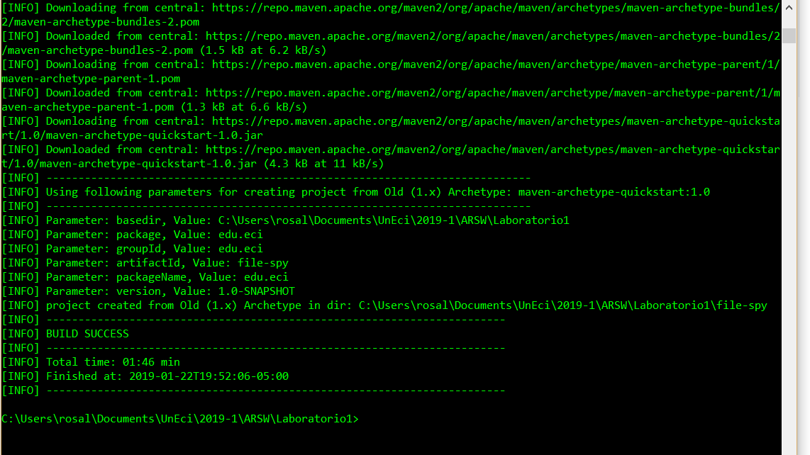
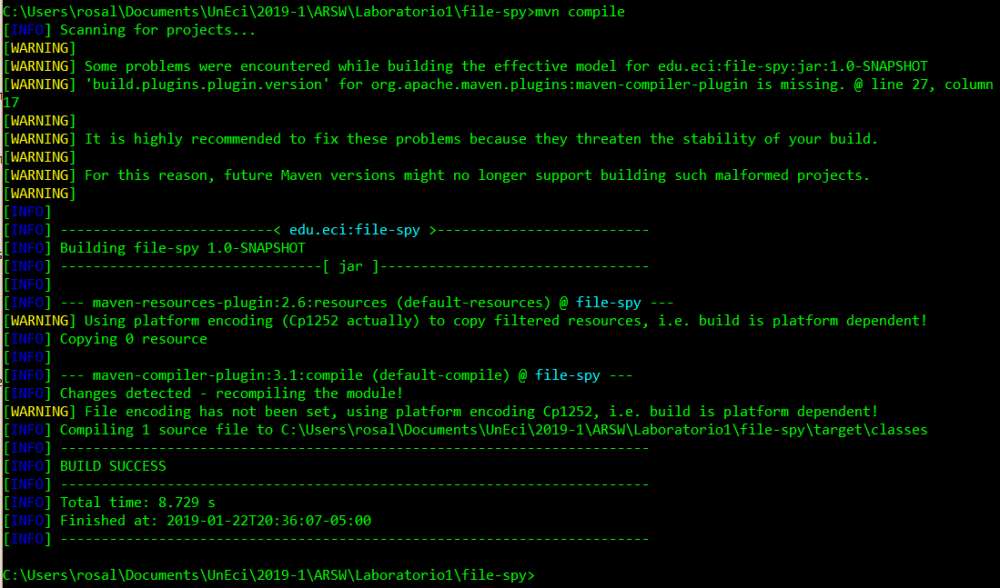
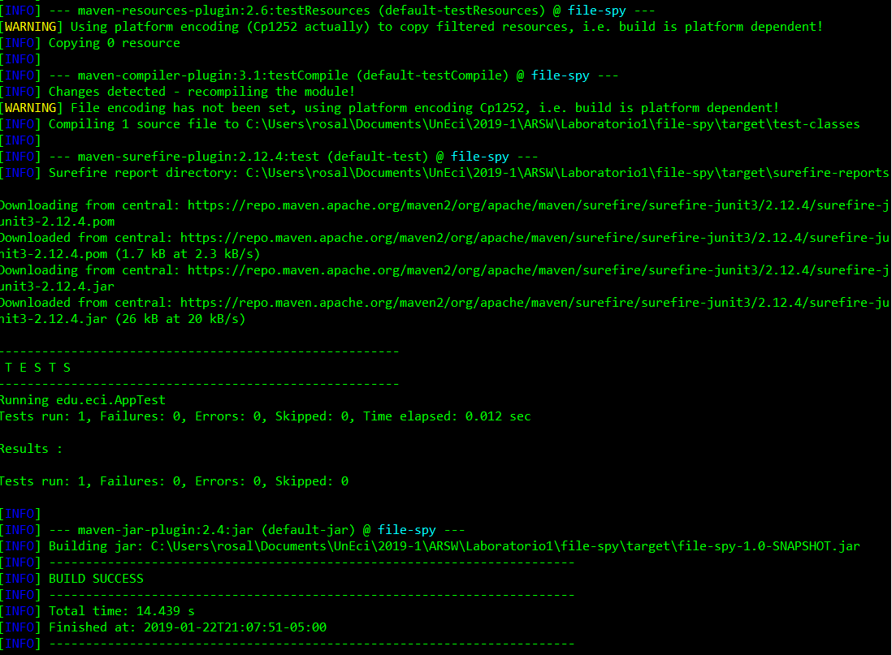
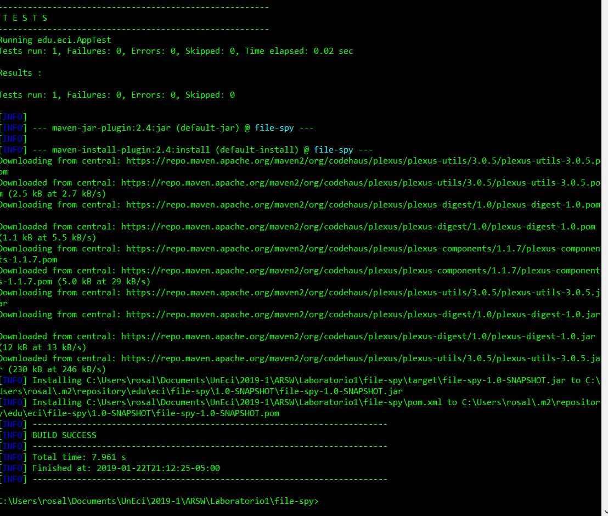
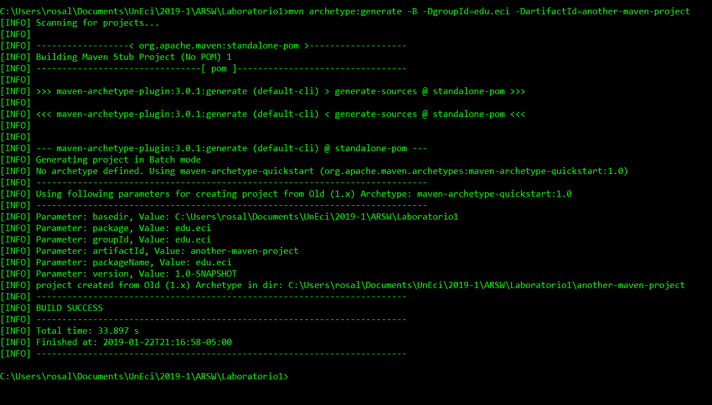
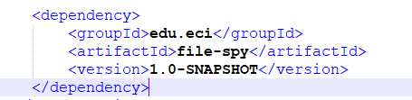
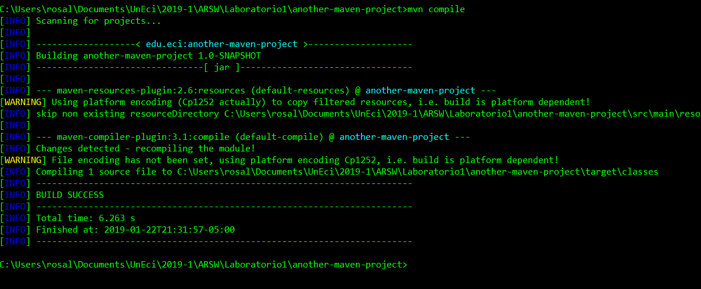
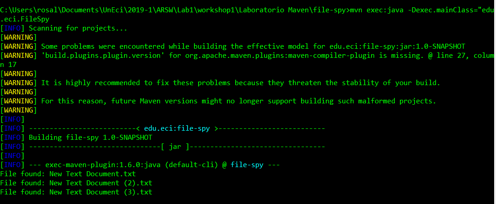

# Laboratorio  N° 1

## GItHuB
### Preserving our changes
 usar el siguiente comando
> git add .

**Answer**: Cual es el proposito de este comando?
> el comando git add se encarga de registrar los cambios que se han realizado

Use the command line to type the command showed below

>git commit -m "Message"

**Answer** : Why we used it?
> el anterior comando es utilizado para establecer el ultimo punto de retorno del proyecto localmente

### Using the push command

> git push origin master

**Answer**: Cual es el proposito de este comando?

>git push es un comandoque sube los cambios hechos en tu ambiente de trabajo a una rama de trabajo remota

### Cloning our repository

> git clone <repository>

**Answer**: What is the purpose of this command?

>el anterior comando se encarga de clonar la rama en donde nos encontramos y trabajarla local mente sin afectar la rama original

## maven
### Create Maven Project
Create a new maven project using the command 
>mvn archetype:generate -B -DgroupId=edu.eci -DartifactId=file-spy, take screenshots.

What do means the -B option in the command?:
> Esta opcion garantiza que en la creacion del proyecto esta creacion no posea colores ni una forma interactiva

What do means the -D option in the command?
> el -D es el encargado de darle la estructura principal del proyecto, se puede ver que despues del comando -D esta el groupID y el artifactID

What do means the groupId, artifactId properties in the command?
> groupID: se encarga de diferenciar el proyecto de otros proyectos existentes, por lo que se necita aplicar un esquema de nombres
artifactID: es el nombre de jar sin ninguna version

Describe the content of the directory that has been created.
> El contenido de los directorios del proyecto consisten en una carpeta src y un archivo de configuracion POM.xml. La carpeta src contiene otras dos carpetas especificamente para el codigo del proyecto en si, y otra carpeta para sus respectivas pruebas de unidad

Create the folders src/main/resources and src/test/resources

### POM FIle

What do means the word SNAPSHOT in the version value?
> La palabra SnapShot en ese contexto nos indica que se esta usando una copia de la version 1.0 en ese momento

What is the purpose of the packing tag into the POM file?
>Nos indica en que forma es se empaquetara el proyecto

What is the purpose of the dependencies and dependency tags into the POM file?
>las dependencias son herramientas que se extraen de otros proyectos los cuales pueden facilitar en gran medida el desarrollo de la aplicacion.

### Dependency Management
Go to the MVNRepository and search fortika-core library. Add a new dependency to the POM file with the last version of this library.

Replace the App class in the source folder with the FileSpy class provided in the workshop.

What is the functionality of this class?
> El funcionamiento de la clase consisten en observar los archivos que se crean en la ruta **DIR_TO_WATCH** funciona de la siguiente manera, se crea un servicio de observacion $$watchService$$ y se pasa como parametro la variable final statica **ENTRY_CREATE**
si al crear un archivo en el directorio posee el mismo tipo de archivo que **FILE_TYPE** imprime en pantalla que se encontro el archivo

Add the next XML code to the POM file.

## Building Lifecycles and Plugins

The three principal Maven lifecycles are **clean**, **default** and **site**. Describe each one.

**default**: el ciclo de vida principal como responsable de la implementación del proyecto

**clean** : para limpiar el proyecto y eliminar todos los archivos generados por la compilación anterior

**site**: para crear la documentación del sitio del proyecto
    
    
Using the terminal execute the command mvn compile. Take the output screenshot. What is this command using for? What are transitive dependencies?
>Este comando es utilizado para compilar los codigos fuetes del proyecto.
Las dependencias transitivas son las dependencias que no son invocadas directamente desde el POM sino que se llaman desde otras dependencias

Using the terminal execute the command mvn package. Take the output screenshot. What is this command using for?
> El comando mvn package sirve para enpaquetar el proyecto creando asi un jar desplegable.

 
Using the terminal execute the command mvn install. Take the output screenshot. What is this command using for?

> el comando mvn install descarga e instala localmente todos los artefactos y plugins que son necesarios para el proyeceto

Generate a new maven project in other folder using the maven command line tools, this project should has as groupId "edu.eci" and as artifactId "another-maven-project". Take the output screenshot.

Replace the code of the App.java class with the following code and do all the necessary steps to compile the code.
> para poder compilar el codigo fuente de la clase es necesario agregar la dependencya de file-Spy con version 1.0 SNAPSHOT

Use the following command to execute the file-spy application 

        mvn exec:java -Dexec.mainClass="edu.eci.FileSpy"
        
Take the output screenshot.

But this time you should knew that the application detect events in a folder when you add new files and print on the screen all the files with the text/csv extension. Test the application using the examples files. Take the output screenshot.